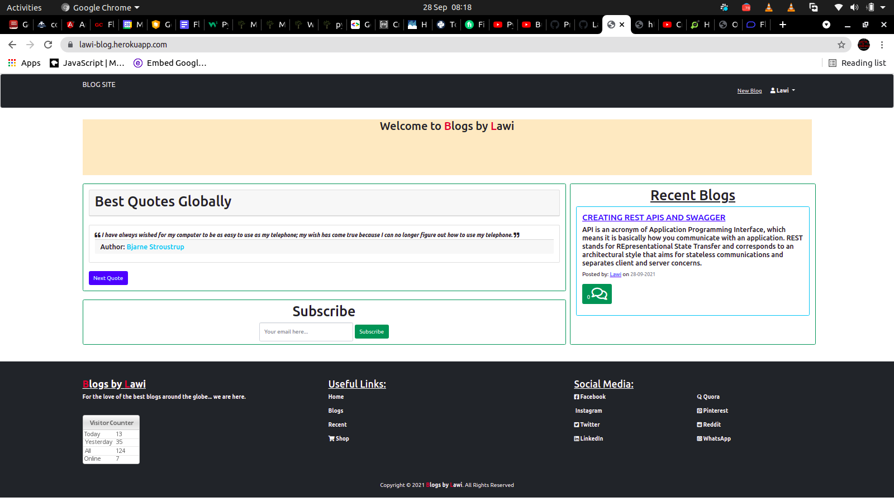

# Blogs By Lawi
Personal Blog Application(Flask).

## Author

Name: Lawrence OTIENO

## Description
Lawi Blog is Flask application for personal blog. People can read blogs, post their own blogs also they can leave comments as their feedback.


## Specifications

The OneMinPitch project requires a pre-requisite understanding of the following:
    - Python 3.8+
    - Flask
    - PostgresSQL

The various installations required to run the project are included in the specs file called: [requirements file](requirements.txt)


## Setup Requirements
* Web Browser
* Internet Connection
* Flask 1.1.2
* Python 3.8
* Terminal


## Installation

* Open Terminal {Ctrl+Alt+T}

```
$git clone https://github.com/LawiOtieno/lawi-blog
```
```
$ cd lawi-blog
```
* Open on your text editor and activate virtual environment.
  
```
$ source virtual/bin/activate
```
* Install dependencies required to run the application.

```
(virtual)$ pip install -r requirements.txt 
```
* To run the application, in your on browser, put this in terminal and follow the link.

```
$ chmod +x start.sh
```
```
$ ./start.sh
```
## Viewing Live
Click this link to view:

## Sample



## Technologies Used
* Python
* Flask
* Bootstrap
* HTML & CSS

## Bugs
So far there is no bug

## Contact Information
For any Suppoert or Feedback, fill free to contact the me through: 
* Email at lawifirst@gmail.com 
* Phone on +254708581688
* Website visit: [LawiOtieno Github](https://github.com/LawiOtieno).
<p>I am open for any collaboration, recommendation and update suggestions.</p>


## License
[MIT License](https://choosealicense.com/licenses/mit/).

Copyright (c) [2021] [Lawrence Otieno]
Permission is hereby granted, free of charge, to any person obtaining a copy
of this software and associated documentation files (the "Software"), to deal
in the Software without restriction, including without limitation the rights
to use, copy, modify, merge, publish, distribute, sublicense, and/or sell
copies of the Software, and to permit persons to whom the Software is
furnished to do so, subject to the following conditions:
The above copyright notice and this permission notice shall be included in all
copies or substantial portions of the Software.
THE SOFTWARE IS PROVIDED "AS IS", WITHOUT WARRANTY OF ANY KIND, EXPRESS OR
IMPLIED, INCLUDING BUT NOT LIMITED TO THE WARRANTIES OF MERCHANTABILITY,
FITNESS FOR A PARTICULAR PURPOSE AND NONINFRINGEMENT. IN NO EVENT SHALL THE
AUTHORS OR COPYRIGHT HOLDERS BE LIABLE FOR ANY CLAIM, DAMAGES OR OTHER
LIABILITY, WHETHER IN AN ACTION OF CONTRACT, TORT OR OTHERWISE, ARISING FROM,
OUT OF OR IN CONNECTION WITH THE SOFTWARE OR THE USE OR OTHER DEALINGS IN THE
SOFTWARE.